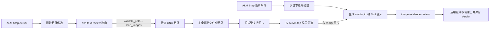
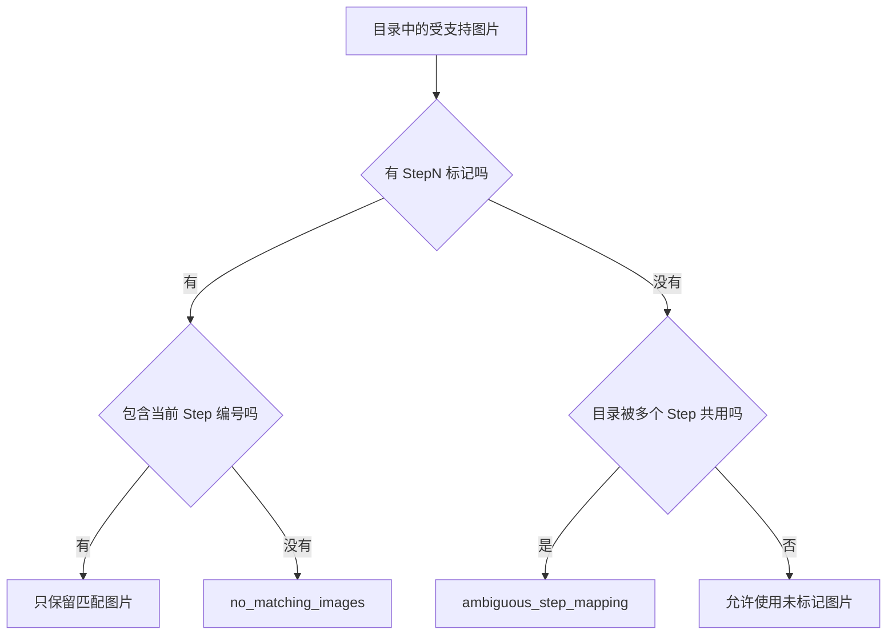

# 图像证据审核流程

本文档是 `image-evidence-review` 的代码导航和行为说明。需要了解图片路径如何验证、
文件夹如何扫描、图片如何关联到 ALM Step，以及图像 Skill 实际负责什么时，从这里开始。

## 结论

路径识别、ALM 附件下载、安全验证、目录扫描和图片到 Step 的映射都由应用程序在调用
`image-evidence-review` 之前完成。

`image-evidence-review` 只接收应用程序已经批准并关联到具体 `review_step` 的图片，判断这些
图片是否清晰且能支持对应的 Expected。它不能读取文件系统或网络，也不负责寻找图片。



## 职责边界

| 阶段 | 负责内容 | 不负责内容 |
| --- | --- | --- |
| 应用程序 | 路径提取、证据路由、根目录约束、目录扫描、格式和大小检查、Step 映射、最终结果聚合 | 判断截图内容是否证明 Expected |
| `image-evidence-review` | 查看已供应的图片，按 Step 判断 `pass`、`fail` 或 `manual` | 文件系统访问、网络请求、路径安全、目录搜索、设备和语言审核 |

Skill 的能力声明在
[`app/review_skills/image-evidence-review/skill.toml`](../app/review_skills/image-evidence-review/skill.toml)。
它只获得 Step 文本、图片元数据和图片内容能力，并明确禁止文件系统和网络访问。

## 完整调用流程

### 1. 从 Actual 提取路径

[`extract_paths()`](../app/services/evidence.py#L104) 从 Step 的 Actual 文本中提取 UNC、Windows、
`file://` 和 HTTP(S) 路径候选，并标记路径类型：

- `image`：扩展名是常见图片格式。
- `html`：扩展名是 `.html` 或 `.htm`。
- `folder_or_unknown`：没有扩展名，或者以目录分隔符结尾。
- `file`：其他文件。

[`step_evidence_profile()`](../app/services/evidence.py#L199) 为每个 Step 创建初始证据配置。
此时只识别候选，不读取路径。

### 2. 决定哪些候选需要检查

[`_apply_reference_routing()`](../app/services/reviews.py#L1428) 使用首轮
`alm-text-review` 的引用决策更新路由：

- 图片或证据文件夹：`validate_path`、`load_images`、`send_to_visual_ai`。
- HTML 报告：`validate_path`、`parse_html_report`。
- 无法确定的普通文件：`validate_path`、`manual_review`。
- 不需要检查的候选会设置 `route_requested = false`。

[`_routed_paths()`](../app/services/reviews.py#L118) 保证后续只处理已请求检查的路径。

### 3. 验证路径安全

第一层由 [`validate_network_evidence_path()`](../app/services/evidence.py#L70) 完成：

1. 路径必须是以 `\\` 开头的绝对 UNC 路径。
2. 路径不能包含 `..`。
3. 必须配置有效的 `allowed_network_root`。
4. 候选路径必须位于允许的根目录之下。

第二层由 [`NetworkImageResolver.resolve()`](../app/services/image_evidence.py#L65) 和
[`_approved_source()`](../app/services/image_evidence.py#L178) 完成：

1. 从允许根目录开始逐级查找实际目录项。
2. 路径的大小写可以不同，但每一级必须真实存在。
3. 拒绝符号链接和 Windows reparse point。
4. 不使用 `Path.resolve()` 跟随链接，防止通过链接逃出批准根目录。
5. 将不存在、无权限和网络不可用分别记录为不同状态。

因此，“字符串看起来位于根目录下”并不足够；实际文件系统遍历也受到边界控制。

### 4. 扫描文件夹并筛选图片

[`NetworkImageResolver.collect()`](../app/services/image_evidence.py#L81) 负责读取单个图片文件或扫描
目录，[`_candidate_files()`](../app/services/image_evidence.py#L195) 负责有界递归。

当前限制：

- 只读取 PNG、JPEG 和 WebP。
- 最多递归两层子目录。
- 每个 Step 最多发送 4 张，每个 Run 最多发送 12 张。
- 单张图片最大 5 MB。
- 每个 Step 图片总量最大 10 MB，每个 Run 最大 15 MB。
- 每次目录扫描最多检查 500 个条目。
- 跳过符号链接和 reparse point。
- 校验文件扩展名对应的二进制签名。
- 网络路径图片内容只保存在内存中；结果记录相对文件名、类型、大小、尺寸和 SHA-256。

ALM run-step 图片附件通过 `run-steps/{step_id}/attachments` 获取元数据，并通过
`attachments/{attachment_id}` 下载。只有 Workspace 开启外部证据评审时才下载；支持格式与
网络图片一致。附件直接归属于对应 Step，不执行 UNC 根目录校验，也不需要根据文件名推断 Step。
附件内容随不可变 revision 快照保存用于后续 Worker 评审，但 source/review hash 只使用附件
元数据和 SHA-256，不对 base64 编码本身计算语义差异。

### 5. 将文件夹图片映射到 Step

[`_prepare_image_evidence()`](../app/services/reviews.py#L1008) 为每个 Step 创建解析器。匹配编号优先
使用 ALM 的 `step.order`；当它不是数字时，才使用内部 `review_step`。

[`_image_step_numbers()`](../app/services/image_evidence.py#L294) 从相对路径和文件名中提取
`StepN` 标记。示例：

| 文件名 | 提取的 Step |
| --- | --- |
| `Step1.png` | 1 |
| `Step01-2.png` | 1 |
| `Step1a.jpg` | 1 |
| `evidence-Step3_result.webp` | 3 |

匹配规则：

1. 如果目录中有匹配当前 Step 的带标记图片，只使用这些图片。
2. 如果目录中存在 Step 标记，但没有当前 Step，返回 `no_matching_images`。
3. 如果多个 Step 共用同一目录，图片必须带 Step 标记；否则返回
   `ambiguous_step_mapping`。
4. 如果目录只路由给一个 Step，并且图片没有 Step 标记，可以使用其中的受支持图片。
5. 应用程序不会根据图片视觉内容猜测它属于哪个 Step。



### 6. 调用图像 Skill

[`_image_review_batches()`](../app/services/reviews.py#L1158) 只收集状态为 `ready` 的图片。
[`_run_image_review_skill()`](../app/services/reviews.py#L1177) 随后：

1. 使用 Step、批次序号和 SHA-256 摘要前缀为每张图片生成 `media_id`。
2. 把图片元数据放入对应 `review_step.images`。
3. 把图片字节作为多模态 `image_url` 数据提供给模型。
4. 只授予 `review.step_text`、`evidence.image.metadata` 和
   `evidence.image.content`。
5. 校验 Skill 返回的 `observed_media_ids` 是否完整、无重复且没有越权引用。

Skill 输入合同见
[`app/review_skills/image-evidence-review/input.schema.json`](../app/review_skills/image-evidence-review/input.schema.json)，
判断规则见
[`app/review_skills/image-evidence-review/instructions.md`](../app/review_skills/image-evidence-review/instructions.md)。

### 7. 聚合最终结果

[`_apply_capability_guards()`](../app/services/reviews.py#L492) 将确定性路径和读取状态转换为
Step issue，并与图像 Skill 结果一起计算最终 Verdict。

常见状态：

| 状态 | 含义 | 结果方向 |
| --- | --- | --- |
| `ready` | 图片已安全读取并可以交给 Skill | 使用 Skill 判断 |
| `not_unc` / `outside_root` | 不是批准根目录下的 UNC 路径 | `fail` |
| `root_not_configured` | 未配置允许根目录 | `manual` |
| `missing` | 路径不存在 | `fail` |
| `no_images` / `no_usable_images` | 没有可审核图片 | `fail` |
| `no_matching_images` | 有图片，但没有匹配当前 Step 的文件名 | `fail` |
| `ambiguous_step_mapping` | 共用目录中的图片没有 Step 标记 | `manual` |
| `denied` / `unavailable` | 权限或网络读取失败 | `manual` |
| `transport_too_large` | 图片超过视觉端点处理预算 | `manual` |

## 运行时怎样查看

打开某个 Run 的详情页，查看以下区域：

- **Evidence routing trace**：每个 Step 检出的路径、触发条件和 actions。
- **Review pipeline**：Image review 是否执行以及调用次数。
- **Skill execution trace**：Skill 版本、状态、能力授权和运行时间。
- **Review criteria**：Screenshot evidence 和 Path validation 的最终状态。

完整流水线也保存在 `ReviewResult.pipeline_json` 中。页面模板位于
[`app/templates/run_detail.html`](../app/templates/run_detail.html)，数据装配入口位于
[`app/web.py`](../app/web.py#L925)。

## 推荐的代码阅读顺序

在 VS Code 中依次打开以下函数，基本不需要阅读其他模块：

1. [`step_evidence_profile()`](../app/services/evidence.py#L199)
2. [`_apply_reference_routing()`](../app/services/reviews.py#L1428)
3. [`_prepare_image_evidence()`](../app/services/reviews.py#L1008)
4. [`NetworkImageResolver.resolve()`](../app/services/image_evidence.py#L65)
5. [`NetworkImageResolver.collect()`](../app/services/image_evidence.py#L81)
6. [`_run_image_review_skill()`](../app/services/reviews.py#L1177)
7. [`_apply_capability_guards()`](../app/services/reviews.py#L492)

在函数名上使用 `Shift+F12` 可以查看引用，使用 `F12` 可以跳到定义。

## 对应测试

主要行为由 [`tests/test_image_evidence.py`](../tests/test_image_evidence.py) 覆盖，包括：

- 递归深度、图片数量和大小限制。
- 图片签名检查。
- 共用目录的 Step 文件名匹配。
- `Step1a` / `Step1b` 字母后缀匹配。
- ALM Step order 优先级。
- 未标记共用目录的歧义处理。
- 安全路径解析不依赖 `Path.resolve()`。

运行：

```powershell
.\.venv\Scripts\python.exe -m pytest -q tests\test_image_evidence.py
```

## 维护要求

修改以下任一行为时，应同步更新本文档和 `tests/test_image_evidence.py`：

- 路径允许规则或批准根目录逻辑。
- 支持的图片格式、递归深度或容量限制。
- Step 文件名识别规则。
- Skill 输入结构或 capability。
- 图片证据状态到最终 Verdict 的映射。